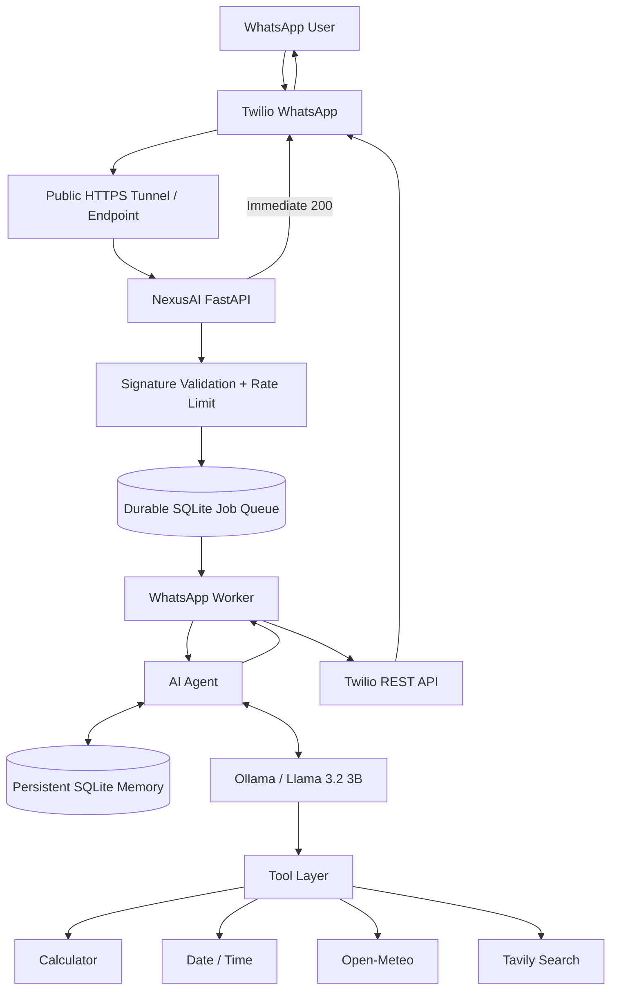

# NexusAI — Production-Ready WhatsApp AI Agent

NexusAI is a containerized AI-powered WhatsApp assistant built with FastAPI, Ollama, Twilio, SQLite, and Docker.

It combines conversational AI with tool calling, persistent user memory, live web search, weather information, calculations, observability, retries, rate limiting, durable background jobs, API authentication, and WhatsApp integration.

The project was designed as a production-style AI engineering system rather than a simple chatbot demo.

---

## Features

### AI Agent

- Local LLM inference with Ollama
- Llama 3.2 3B model
- Multi-turn conversations
- Controlled tool calling
- Tool guardrails
- Multi-user support

### Tools

NexusAI currently supports:

- Calculator
- Current date and time
- Live weather using Open-Meteo
- Live web search using Tavily

### Persistent Memory

NexusAI maintains user context using SQLite:

- Recent conversation history
- Conversation summaries
- Structured long-term memories
- Multi-user memory isolation
- Memory extraction optimization
- Persistent storage across Docker container recreation

### WhatsApp Integration

NexusAI integrates with WhatsApp through Twilio:

- Twilio WhatsApp webhook
- Twilio request signature verification
- Immediate webhook acknowledgement
- Asynchronous AI processing
- Outbound WhatsApp responses
- Per-user WhatsApp rate limiting
- Durable WhatsApp job queue
- Duplicate webhook protection using Twilio MessageSid
- Job retry and interrupted-job recovery

### Reliability

The application includes:

- External HTTP retries
- Exponential backoff
- Timeout handling
- Error classification
- Retryable vs non-retryable failures
- Durable job retries
- Graceful worker shutdown
- Readiness and liveness endpoints

### Observability

NexusAI provides:

- Structured logging
- Request IDs
- End-to-end request tracing
- Latency measurements
- Tool execution metrics
- LLM latency metrics
- Rotating application logs
- Docker log rotation

### Security

Implemented protections include:

- Twilio webhook signature verification
- API-key authentication for `/ask`
- Input size limits
- API rate limiting
- WhatsApp rate limiting
- Secret management through environment variables
- Docker `no-new-privileges`
- Localhost-only Docker API exposure

### Deployment

The application is fully containerized using Docker Compose:

- NexusAI FastAPI container
- Ollama container
- Automatic model initialization
- Persistent Ollama model volume
- Persistent NexusAI SQLite volume
- Health checks
- Automatic container restart policies

---

## Architecture



The WhatsApp webhook does not wait for LLM inference. Incoming messages are stored as durable jobs and acknowledged immediately. A background worker processes jobs separately and sends completed responses using the Twilio REST API.

---

## Tech Stack

| Layer | Technology |
| --- | --- |
| API | FastAPI |
| Language | Python 3.14 |
| LLM Runtime | Ollama |
| Model | Llama 3.2 3B |
| Database | SQLite |
| WhatsApp | Twilio |
| Live Search | Tavily |
| Weather | Open-Meteo |
| HTTP Client | HTTPX |
| Containers | Docker |
| Orchestration | Docker Compose |
| Server | Uvicorn |

---

## Project Structure

```text
whatsapp-agent/
│
├── app/
│   ├── agent.py
│   ├── config.py
│   ├── errors.py
│   ├── health.py
│   ├── http_retry.py
│   ├── job_store.py
│   ├── llm.py
│   ├── logging_config.py
│   ├── memory.py
│   ├── memory_extractor.py
│   ├── rate_limiter.py
│   ├── request_context.py
│   ├── summarizer.py
│   ├── tools.py
│   ├── twilio_client.py
│   ├── twilio_security.py
│   └── whatsapp_worker.py
│
├── logs/
├── backups/
│
├── Dockerfile
├── docker-compose.yml
├── requirements.txt
├── start.py
├── test_deployment.py
├── test_job_queue.py
├── test_retry.py
├── .dockerignore
├── .env.example
├── .gitignore
└── README.md
```

---

## Local Development

Create and activate a virtual environment:

```bash
python -m venv venv
```

Windows:

```bash
venv\Scripts\activate
```

Install dependencies:

```bash
pip install -r requirements.txt
```

Create `.env` from `.env.example` and configure the required environment variables.

Start the application:

```bash
python start.py
```

Development mode can also use:

```bash
python -m uvicorn app.main:app --reload
```

---

## Docker Setup

Validate Docker Compose:

```bash
docker compose config --quiet
```

Build NexusAI:

```bash
docker compose build nexusai
```

Start the complete stack:

```bash
docker compose up -d
```

Check services:

```bash
docker compose ps
```

Verify the Ollama model:

```bash
docker compose exec ollama ollama list
```

The expected model is:

```text
llama3.2:3b
```

---

## Health Checks

Liveness:

```text
GET /health
```

Example:

```bash
curl http://127.0.0.1:8000/health
```

Readiness:

```text
GET /ready
```

Example:

```bash
curl http://127.0.0.1:8000/ready
```

Readiness validates both SQLite and Ollama connectivity.

---

## Ask API

The REST AI endpoint requires an API key.

Endpoint:

```text
POST /ask
```

Required header:

```text
X-API-Key: <your-api-key>
```

Example request:

```bash
curl -X POST http://127.0.0.1:8000/ask \
  -H "Content-Type: application/json" \
  -H "X-API-Key: YOUR_API_KEY" \
  -d "{\"user_id\":\"demo_user\",\"message\":\"Calculate 12 multiplied by 7.\"}"
```

Example response:

```json
{
  "status": "success",
  "user_id": "demo_user",
  "response": "The result of 12 multiplied by 7 is 84."
}
```

---

## WhatsApp Request Flow

```text
WhatsApp User
      ↓
Twilio
      ↓
POST /webhook/whatsapp
      ↓
Twilio Signature Verification
      ↓
Input Validation
      ↓
Rate Limiting
      ↓
Store Durable SQLite Job
      ↓
Immediate HTTP 200
      ↓
Background Worker
      ↓
NexusAI Agent
      ↓
Ollama + Tools + Memory
      ↓
Twilio REST API
      ↓
WhatsApp Reply
```

This architecture prevents slow local LLM inference from blocking the Twilio webhook.

---

## Durable Job Processing

WhatsApp jobs are stored in SQLite before acknowledgement.

Each job contains:

- Unique job ID
- Twilio source MessageSid
- Sender
- Incoming message
- Request ID
- Processing status
- Retry attempts
- Generated response
- Error information

Jobs support:

```text
pending
→ processing
→ completed
```

Failures can transition back to:

```text
pending
```

for retry.

After maximum retry attempts:

```text
failed
```

Interrupted `processing` jobs are recovered when NexusAI restarts.

Generated responses are persisted before outbound delivery so a temporary Twilio failure does not require running the LLM again.

---

## Persistent Storage

NexusAI uses:

```text
/data/nexusai_memory.db
```

inside Docker.

The database is stored in the Docker volume:

```text
whatsapp-agent_nexusai_data
```

It contains:

- Conversation messages
- Conversation summaries
- Structured user memories
- Durable WhatsApp jobs

The data survives container recreation.

Do not use:

```bash
docker compose down -v
```

unless persistent volumes are intentionally being deleted.

---

## Backup

SQLite backups should be created using SQLite's backup API rather than copying an actively written database directly.

Example integrity check:

```bash
python -c "import sqlite3; c=sqlite3.connect('nexusai_memory.backup.db'); print(c.execute('PRAGMA integrity_check').fetchone()[0])"
```

Expected:

```text
ok
```

---

## Environment Variables

Important configuration categories include:

```text
Application
Ollama
Tavily
Open-Meteo
Memory
Rate Limiting
Logging
Twilio
Durable WhatsApp Jobs
API Security
```

Use:

```text
.env.example
```

as the configuration template.

Never commit:

```text
.env
```

or real API keys/tokens.

---

## Testing

Compile validation:

```bash
python -m py_compile app/main.py
```

Retry tests:

```bash
python test_retry.py
```

Durable queue tests:

```bash
python test_job_queue.py
```

Deployment tests:

```bash
python test_deployment.py
```

The final regression suite also validates:

- Calculator
- Current date/time
- Weather
- Live web search
- Tool guardrails
- Persistent memory
- Container recreation
- API authentication
- Twilio signature security
- Real WhatsApp inbound/outbound flow

---

## Production Engineering Decisions

NexusAI intentionally includes several production-oriented patterns:

### Fast webhook acknowledgement

LLM inference may take tens of seconds on local hardware. Twilio is therefore acknowledged before inference begins.

### Durable background jobs

FastAPI in-process background tasks were replaced with a persistent SQLite-backed job queue so accepted messages can survive application restarts.

### Tool guardrails

The LLM cannot freely invoke every tool for arbitrary prompts. Deterministic guardrails validate whether each requested tool is appropriate.

### Memory optimization

High-confidence user facts are extracted directly when possible, while unnecessary LLM-based memory extraction is skipped.

### Request tracing

A request ID follows execution across the webhook, agent, tools, memory layer, worker, and outbound Twilio request.

---

## Current Limitations

- The current LLM is a small local `llama3.2:3b` model.
- CPU inference can be significantly slower than hosted or GPU-backed models.
- SQLite is appropriate for the current single-instance architecture but would need reconsideration for a horizontally scaled deployment.
- The durable worker currently runs inside the NexusAI application process.
- The current WhatsApp demo uses Twilio's Sandbox/testing environment.
- A branded NexusAI WhatsApp business sender requires production WhatsApp onboarding.
- A temporary tunnel may be used during local testing; a permanent production deployment would use a stable HTTPS endpoint.

---

## Future Improvements

Potential next steps include:

- GPU-backed or hosted LLM inference
- PostgreSQL for distributed deployments
- Redis / dedicated worker infrastructure
- Multiple application workers
- Permanent cloud hosting
- Permanent HTTPS domain
- Official NexusAI WhatsApp Business sender
- Admin dashboard
- Analytics and monitoring
- Automated CI/CD

---

## Security Notes

Never commit:

- Twilio Auth Tokens
- Twilio Account SID credentials
- Tavily API keys
- NexusAI API keys
- `.env`
- Production databases
- Conversation backups

If a secret is accidentally committed, rotate the secret rather than relying only on deleting it from the latest Git commit.

---

## Project Status

Core technical implementation:

**Complete**

NexusAI currently demonstrates a full AI engineering pipeline combining:

```text
LLM orchestration
+ tool calling
+ guardrails
+ long-term memory
+ reliability
+ observability
+ security
+ durable job processing
+ Docker deployment
+ persistent storage
+ real WhatsApp integration
```

---

## Author

Built as an AI Engineering portfolio project.