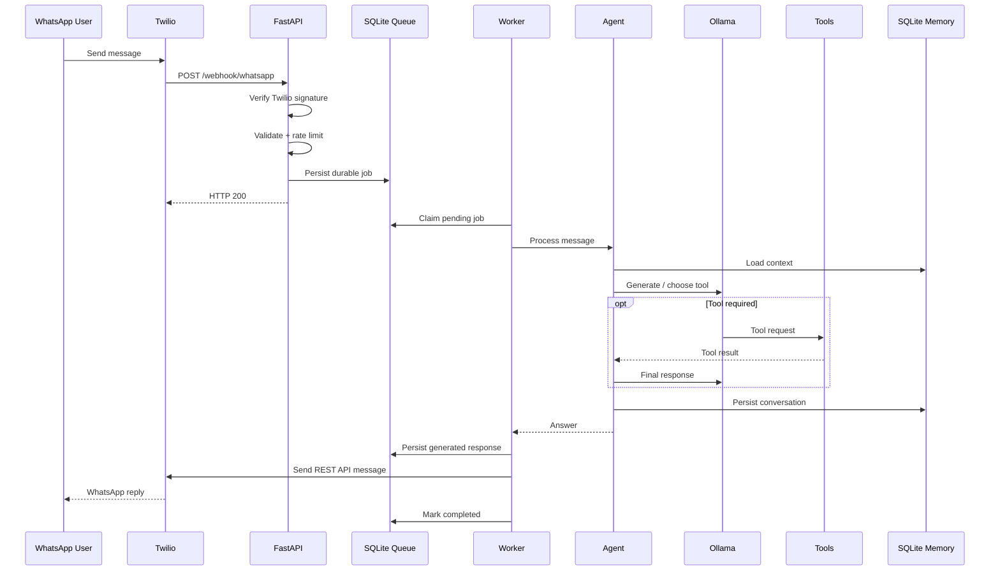

# NexusAI Architecture

## System Overview

NexusAI is a WhatsApp-based AI agent built around an asynchronous request-processing architecture.

The system separates the inbound webhook lifecycle from LLM inference so slow model execution does not block Twilio requests.

## WhatsApp Flow



## Main Components

### FastAPI

Handles:

- `/health`
- `/ready`
- `/ask`
- `/webhook/whatsapp`
- Request tracing
- Authentication
- Validation
- Rate limiting

### AI Agent

Responsible for:

- Conversation context
- Structured memories
- Conversation history
- LLM orchestration
- Tool execution
- Memory maintenance

### Ollama

Runs the local Llama model independently from the FastAPI application.

Docker networking exposes Ollama internally through:

```text
http://ollama:11434
```

### SQLite

The persistent database stores:

- Conversation messages
- Summaries
- Structured user memories
- Durable WhatsApp jobs

Docker path:

```text
/data/nexusai_memory.db
```

### Durable Worker

The worker polls pending WhatsApp jobs and processes them asynchronously.

This prevents webhook timeouts and allows jobs to survive application restarts.

## Reliability Model

External HTTP requests use:

- Timeouts
- Retry classification
- Exponential backoff
- Retryable status handling

WhatsApp jobs use:

- Persistent state
- Maximum attempts
- Retry delays
- Crash recovery
- Response reuse

## Security Model

The `/ask` endpoint uses:

```text
X-API-Key
```

WhatsApp uses:

```text
X-Twilio-Signature
```

Additional controls include:

- Rate limiting
- Message length limits
- Secret environment variables
- Docker localhost binding
- no-new-privileges

## Deployment Model

```text
Docker Compose
├── nexusai
│   ├── FastAPI
│   └── WhatsApp Worker
│
├── ollama
│   └── llama3.2:3b
│
├── nexusai_data
│   └── persistent SQLite database
│
└── ollama_data
    └── persistent model files
```

## Scaling Considerations

The current architecture intentionally uses a single NexusAI application worker.

Horizontal scaling would require replacing process-local components such as the rate limiter and job worker coordination with distributed infrastructure.

A larger deployment could use:

```text
FastAPI
+ PostgreSQL
+ Redis
+ dedicated workers
+ hosted/GPU LLM
```